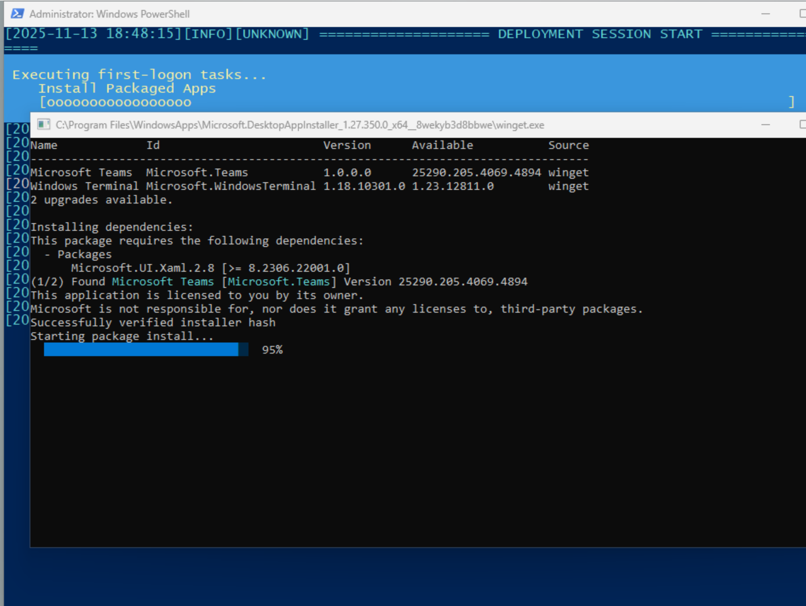

# Introduction
Deploy a Windows 11 Pro 25H2 build using Unattended automation for the ASUS ROG XBOX ALLY/X

## Scope
A full Windows 11 25H2 deployment

## Out of Scope
- **Activation:** The product key used in the autounattend.xml is a generic (non OEM) Pro key - but Windows will ask for activation
- **Drivers:** Due to the size limitations of GitHub, drivers are not included in the repo, but detailed instructions are listed in the [**DRIVERS**](https://github.com/you-are-on-mute/unattend-ally-x/tree/commit#drivers) section below.

## Prereqs
1. A working laptop or PC (build PC).
2. Suitable space on your local hard drive (at least 10GB).
3. A USB flash drive (at least 16GB).
4. A Windows 11 25H2 x64 Pro ISO.
5. Your WiFi Profile from the network you intend to use the Ally on.<br />
Export WiFi profile information can be found [here](https://learn.microsoft.com/en-us/intune/intune-service/configuration/wi-fi-settings-import-windows-8-1#export-wi-fi-settings-from-a-windows-device) 
- **Note** the example of exporting with the PSK - **This is required**.<br />
There is an Example-WiFi.xml provided for reference in the `$OEM$\$$\Setup\Scripts` Folder.
6. Windows ADK for your build PC [here](https://learn.microsoft.com/en-us/windows-hardware/get-started/adk-install#download-the-adk-101261002454-december-2024)
- **Note:** You do not require the ADK PE, and you only need to include the Deployment and Imaging tools when installing.

# What does this do?
1. Installs Windows 11 25H2 Pro.
2. Installs ASUS ROG ALLY Drivers - *You need to download and build these*.
3. Removes unwanted Windows 11 Bloatware Apps.
4. Removes unwanted Windows 11 Features.
5. Removes unwanted Windows 11 Capabilities.
6. Registry items to remove undesired apps and content (recall, new Outlook, Co-Pilot, etc).
7. Automatic WiFi Profile.
8. Installs Winget apps (customisable) - including g-helper and VIVE. 
- **Note:** Default Winget will not install apps until it has updated itself - the install Apps script ensures Winget is ready to function.
9. Enables the option of XBOX FSE using VIVE.
10. Beautifies start menu and task bar pins.
11. Provides full event logging to Windows Event Viewer, Console output and logs found at `C:\Logs`.
12. Renames the XBOX ALLY from the random name given to Windows to something more meaningful.

# High Level Instructions
1. Copy/Extract a Windows 11 25H2 Pro iso to your local drive.\
This is best achieved using a simple xcopy command, assumiung D:\ is your mounted ISO.
```
xcopy D:\*.* /s/e/f C:\Extract
```
2. Copy, Download, or Clone the repo and move the `$OEM$` Folder and the autounattend.xml to the root of the extracted ISO. For example your working folder should look like this:
```
\$OEM$
\boot
\efi
\sources
\support
autorun.inf
autounattend.xml
bootmgr
bootmgr.efi
setup.exe
```
3. Export your WiFi Profile from another Windows device that is connected to the network you will use for the Ally - save this as `WiFi.xml`.
4. Add your WiFi.xml to:
```
C:\Extract\$OEM$\$$\Setup\Scripts
```

# Drivers
1. The most efficient way to deploy drivers is to build a WIM with the drivers mounted. 
2. Create a working folder on your build PC, for example: `C:\Drivers`.
3. Download all of the drivers for your ASUS ROG Model from:
- [ROG XBOX Ally X](https://rog.asus.com/gaming-handhelds/rog-ally/rog-xbox-ally-x-2025/helpdesk_download/?model=rog%20xbox%20ally%20x%20%282025%29)
- [ROG XBOX ALLY](https://rog.asus.com/gaming-handhelds/rog-ally/rog-xbox-ally-2025/helpdesk_download/?model=rog%20xbox%20ally%20%282025%29)
4. When *installing* each of the drivers, you can select to *Extract* them. Extract them to your `C:\Drivers` folder.
5. Now, open Deployment and Imaging Command Line `(Start > Deployment and Imaging Tools Environment )`.
6. At the prompt use the following example command to build the WIM file (this is model agnostic):
```
dism.exe /Capture-Image /ImageFile:"C:\Drviers\ROG_ALLY.wim" /CaptureDir:"C:\Drviers\" /Name:"ASUS ROG XBOX Drivers" /Description:"ASUS ROG XBOX Drivers" /Compress:max
```
7. Copy the new WIM file to `$OEM$\$$\Setup\Scripts\Drivers` folder (there is an example.wim file in this location which can be deleted).

# Optional
1. Add applications to "PackagedApps.ps1" under the `App Installation List` section.
2. Use [OSDBuilder](https://osdbuilder.osdeploy.com/) to remove content from your Windows 11 25H2 ISO before extraction (Not required as RemoveAppX.ps1 will do all the hard work, but some prefer this method).

# Managing the autounattend.xml
1. Open the autounattend.xml.
2. Change the following lines noting the following:

| Line  | Description | Value |
| ----------- | ----------- | ----------- |
| 86 | Organization | Any value, including blank |
| 161 | RegisteredOrganization | Any value, including blank |
| 162 | RegisteredOwner | Any value, including blank |
| 193 | Password Value | This is Base64 Encoded Value with some extra info. If you use plain text, you must change Line 194 to true |
| 194 | Password Text Format | If you are unable to provide a Base64 encoded password, set this to true |
| 196 | DisplayName | Windows Username format, e.g. jsmith |
| 198 | Name | Windows Name format, e.g. John Smith |
| 203 | Auto Logon Name | Use the value you provided in Line 196 |
| 207 | Password Value | This is Base64 Encoded Value from Line 193. If you use plain text, you must change Line 208 to true |
| 208 | Password Text | If you are unable to provide a Base64 encoded password, set this to true |

# Building the ISO
1. On your build PC, ideally use Windows ADK Deployment and Imaging Tools - Other ISO builders are available, but this guide is for native Windows Applications. 
2. Open Deployment and Imaging Tools Command Line and run:
```
oscdimg.exe -m -o -u2 -udfver102 -bootdata:2#p0,e,bC:\Extract\boot\etfsboot.com#pEF,e,bC:\Extract\efi\microsoft\boot\efisys.bin C:\Extract C:\ASUS_ROG_Win11_25H2_x64.iso
```
3. The above command takes your `C:\Extract` folder and bundles it up into an ISO called `ASUS_ROG_Win11_25H2_x64` and saves it at the root of your C: drive. You can name the ISO to anything you prefer.
4. Use [Rufus](https://rufus.ie/en/), or another media write tool to write the new ISO to your USB stick.

# Running the ISO
**WARNING** This action will fully wipe the internal SSD. All local game and game save data will be destroyed.
1. Power off your ALLY.
2. Attach the USB stick with a USB-C adapter.
3. Power on and repeatedly press `Volume Down (-)` button until you are presented with the BIOS.
4. Select the boot options menu.
5. Select your USB stick.
6. Sit back and wait.

# Post tasks
1. Create a PIN using Windows Hello.
2. Open the XBOX app and click on the offer of running in FSE.
3. Start `g-helper` and enable "Run on Startup" - This will automatticaly get assigned to the Armoury Crate button. g-helper is installed via Winget and can be found at this location on the ALLY:
```
C:\Program Files\WinGet\Packages\seerge.g-helper_Microsoft.Winget.Source_8wekyb3d8bbwe
```
4. Activate Windows with your product key.

# Dontations
If you appreciate this project, and are willing, **PLEASE** consider donating to Teenage Cancer Trust [here](https://www.justgiving.com/page/charlotte-cosquer-6?utm_medium=FR&utm_source=WA).

# Appendix & Screenshots

